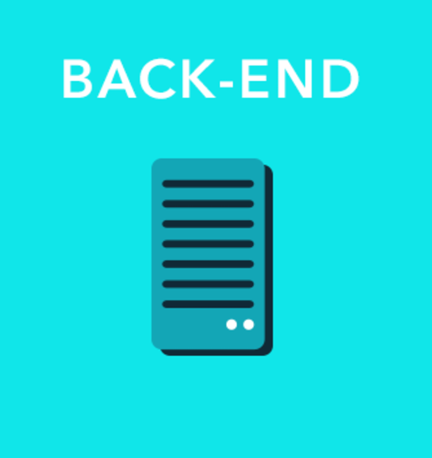

# django-tdd-restful-api

  
  
  
  

## 유튭에 연결되어 있는 링크입니다.
## Vol-1
http://www.youtube.com/watch?v=8acl5bOsaUg&feature=youtu.be

## Vol-2
http://www.youtube.com/watch?v=eKi66CRYOMY

## Vol-3
http://www.youtube.com/watch?v=kZo5PBjbyY8

## Vol-4
......
