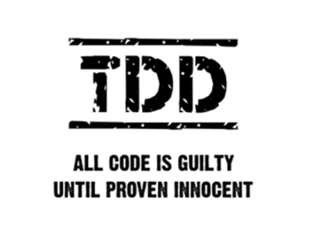

# django-tdd-restful-api


 [](https://travis-ci.org/elastic7327/django-tdd-restful-api) [](https://gitter.im/django-tdd-restful-api/Lobby) 


<p align="left">
  
  
  
</p>


## 유튭에 연결되어 있는 링크입니다.
## Vol-1
```sh
# 이런식으로 체크아웃을 하시면서 볼륨 별로 확인을 하실 수있습니다.
# 바로 아래의 git 명령어는 feature/vol1 브랜치를 확인 하는 명령어입니다.
# 아래 vol1 브랜치로 이동하시면 vol1 에 해당하 유툽 동영상에서 
# 작성을 했던 코드들을 확인 하실 수 있습니다.
$ git checkout feature/vol1
```
http://www.youtube.com/watch?v=8acl5bOsaUg&feature=youtu.be

## Vol-2

```sh
$ git checkout feature/vol2
```
http://www.youtube.com/watch?v=eKi66CRYOMY

## Vol-3
```sh
$ git checkout feature/vol3
```
http://www.youtube.com/watch?v=kZo5PBjbyY8

## Vol-4 Oauth2 (토큰인증)
```sh
$ git checkout feature/vol4
```
http://youtu.be/vir9KHPYKWY

## Vol-5 rabbitmq+celery (비동기, 메시지큐)
```sh
$ git checkout feature/vol5
```
http://youtu.be/wz5NExpzzYI


## Vol-6 django-extensions (useful plugin, 추천해드리는 플러그인)
```sh
$ git checkout feature/vol6
```
https://youtu.be/PBTh9zNvNnE

## Vol-7 django send email example 
```sh
$ git checkout feature/vol7
```

## Vol-8
```
Mixin
```

## Vol-9
....


TDD를 이용해서 밥벌어 먹고있는 필드에서 직접 사용하고 있는 방법.
테크닉 등을 모두? 찍어서 올릴 예정입니다.
이걸 다 찍어서 올리고 난 뒤에면 . . Go 또는 Earlng 을 T.D.D로 
하는 방법을 찍어서 올릴 예정입니다.
모두 모두  테스트 하세요 

